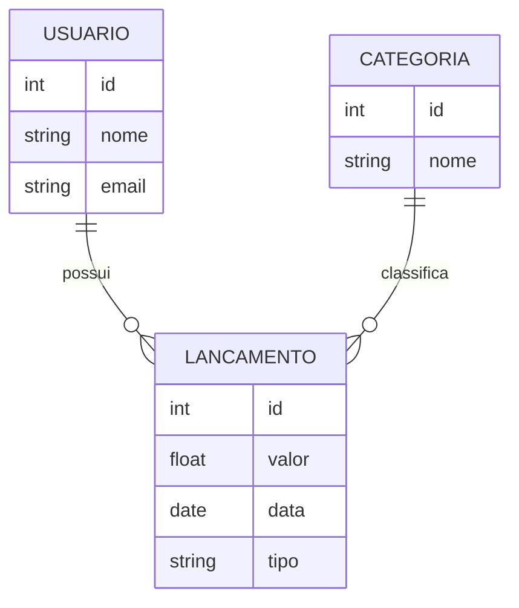
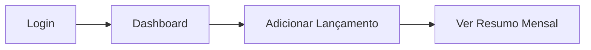

# Modelagem Inicial

## Diagrama de Entidade-Relacionamento (ER)

```mermaid
erDiagram
    USUARIO ||--o{ LANCAMENTO : possui
    CATEGORIA ||--o{ LANCAMENTO : classifica
    USUARIO {
        int id
        string nome
        string email
    }
    LANCAMENTO {
        int id
        float valor
        date data
        string tipo
    }
    CATEGORIA {
        int id
        string nome
    }
```

## Fluxo Principal do Sistema

```mermaid
flowchart LR
    A[Login] --> B[Dashboard]
    B --> C[Adicionar Lançamento]
    C --> D[Ver Resumo Mensal]
```