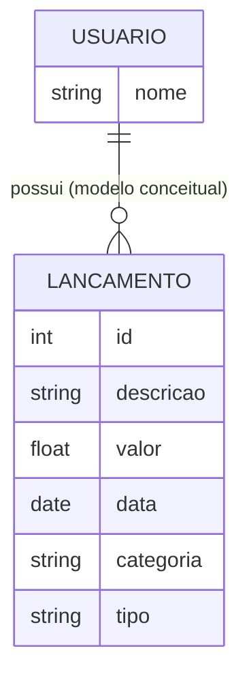
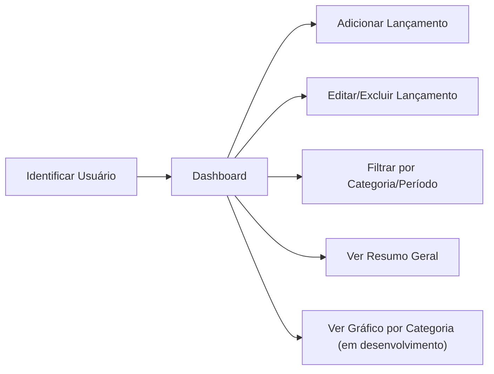

# Modelagem Inicial

## Diagrama de Entidade-Relacionamento (ER)

> **Nota sobre o modelo:**
> - `categoria` e `tipo` são campos de domínio fixo (não têm tabela própria): `categoria` aceita Bolsa, Auxílio, Alimentação, Transporte, Material Escolar, Moradia, Lazer ou Outros; `tipo` aceita receita ou despesa.
> - O relacionamento USUARIO–LANCAMENTO é conceitual. Na versão atual (sem backend), os lançamentos ficam em um único array no localStorage, sem isolamento real por usuário — o "usuário" serve apenas para identificação por nome (RF01), sem autenticação (RNF04).

## Fluxo Principal do Sistema

